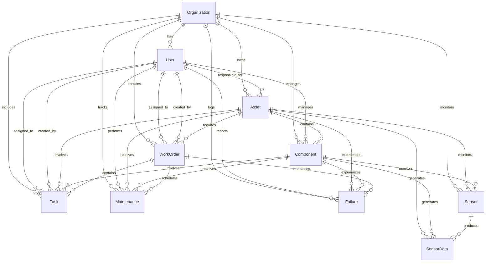

# GMAO FaiLess - Sistema de Gestión de Mantenimiento de Activos

## 📋 Descripción del Proyecto

GMAO FaiLess es un sistema integral de gestión de mantenimiento de activos (GMAO/CMMS) diseñado para optimizar la gestión de equipos industriales, mantenimiento preventivo y correctivo, y monitorización en tiempo real.

## 🗃️ Modelo de Datos

### Arquitectura de Base de Datos Híbrida

El sistema utiliza una arquitectura híbrida que combina:
- **PostgreSQL**: Para datos relacionales (assets, usuarios, órdenes de trabajo)
- **MongoDB**: Para datos de sensores IoT y series temporales

### 📊 Modelo Relacional (PostgreSQL)

#### Entidades Principales

##### 1. **Organization** (Organizaciones)
```sql
organizations
├── id (PK)
├── name (UNIQUE)
├── slug (UNIQUE)
├── description
├── domain (UNIQUE)
├── is_active
├── max_users
├── max_assets
├── created_at
└── updated_at
```

##### 2. **User** (Usuarios)
```sql
users
├── id (PK)
├── username (UNIQUE)
├── first_name
├── last_name
├── email (UNIQUE)
├── hashed_password
├── role (Admin, Supervisor, Tecnico, Consultor, OrgAdmin)
├── is_active
├── organization_id (FK → organizations.id)
├── created_at
└── updated_at
```

##### 3. **Asset** (Activos)
```sql
assets
├── id (PK)
├── name
├── description
├── asset_type
├── model
├── serial_number (UNIQUE)
├── location
├── status
├── purchase_date
├── warranty_expiry
├── purchase_cost
├── current_value
├── responsible_id (FK → users.id)
├── organization_id (FK → organizations.id)
├── created_at
└── updated_at
```

##### 4. **Component** (Componentes)
```sql
components
├── id (PK)
├── name
├── description
├── component_type
├── model
├── serial_number (UNIQUE)
├── location
├── status
├── installed_date
├── warranty_expiry
├── purchase_cost
├── current_value
├── maintenance_interval_days
├── last_maintenance_date
├── asset_id (FK → assets.id)
├── responsible_id (FK → users.id)
├── organization_id (FK → organizations.id)
├── created_at
└── updated_at
```

##### 5. **Sensor** (Sensores)
```sql
sensors
├── id (PK)
├── name
├── sensor_type
├── description
├── unit
├── min_value
├── max_value
├── warning_threshold
├── critical_threshold
├── location
├── status
├── last_reading
├── last_reading_time
├── asset_id (FK → assets.id) [NULLABLE]
├── component_id (FK → components.id) [NULLABLE]
├── organization_id (FK → organizations.id)
├── created_at
└── updated_at
```

##### 6. **WorkOrder** (Órdenes de Trabajo)
```sql
workorders
├── id (PK)
├── title
├── description
├── work_type (preventive, corrective, emergency)
├── status (open, in_progress, completed, cancelled)
├── priority (low, medium, high, critical)
├── estimated_hours
├── actual_hours
├── estimated_cost
├── actual_cost
├── scheduled_date
├── started_date
├── completed_date
├── asset_id (FK → assets.id)
├── assigned_to (FK → users.id)
├── created_by (FK → users.id)
├── failure_id (FK → failures.id)
├── organization_id (FK → organizations.id)
├── created_at
└── updated_at
```

##### 7. **Maintenance** (Registros de Mantenimiento)
```sql
maintenance
├── id (PK)
├── description
├── status (scheduled, in_progress, completed, cancelled)
├── maintenance_type (preventive, corrective, predictive)
├── scheduled_date
├── completed_date
├── duration_hours
├── cost
├── notes
├── asset_id (FK → assets.id) [NULLABLE]
├── component_id (FK → components.id) [NULLABLE]
├── user_id (FK → users.id)
├── workorder_id (FK → workorders.id)
├── organization_id (FK → organizations.id)
├── created_at
└── updated_at
```

##### 8. **Failure** (Fallos)
```sql
failures
├── id (PK)
├── description
├── status (reported, investigating, resolved)
├── severity (low, medium, high, critical)
├── reported_date
├── resolved_date
├── resolution_notes
├── asset_id (FK → assets.id) [NULLABLE]
├── component_id (FK → components.id) [NULLABLE]
├── reported_by (FK → users.id)
├── organization_id (FK → organizations.id)
├── created_at
└── updated_at
```

##### 9. **Task** (Tareas)
```sql
tasks
├── id (PK)
├── title
├── description
├── status (pending, in_progress, completed, cancelled)
├── priority (low, medium, high)
├── due_date
├── assigned_to (FK → users.id)
├── asset_id (FK → assets.id) [NULLABLE]
├── component_id (FK → components.id) [NULLABLE]
├── workorder_id (FK → workorders.id)
├── organization_id (FK → organizations.id)
├── created_by_id (FK → users.id)
├── created_at
└── updated_at
```

##### 10. **SensorData** (Datos de Sensores)
```sql
sensor_data
├── id (PK)
├── sensor_id (FK → sensors.id)
├── asset_id (FK → assets.id) [NULLABLE]
├── component_id (FK → components.id) [NULLABLE]
├── value
└── timestamp
```

### 🔗 Diagrama Entidad-Relación



### 🏗️ Jerarquía de Activos

El modelo implementa una jerarquía de dos niveles:

```
Organization
└── Asset (Activo Principal)
    ├── Component 1
    │   ├── Sensor A
    │   ├── Sensor B
    │   └── SensorData
    ├── Component 2
    │   ├── Sensor C
    │   └── SensorData
    └── Sensor D (Sensor del Asset)
        └── SensorData
```

### 📈 Modelo NoSQL (MongoDB)

#### Colección: sensor_readings
```javascript
{
  _id: ObjectId,
  sensor_id: Integer,
  asset_id: Integer,
  component_id: Integer,
  readings: [
    {
      timestamp: ISODate,
      value: Number,
      status: String,
      metadata: Object
    }
  ],
  created_at: ISODate,
  updated_at: ISODate
}
```

### 🔐 Roles y Permisos

| Rol | Descripción | Permisos |
|-----|-------------|----------|
| **Admin** | Administrador del Sistema | Acceso completo a todas las funcionalidades |
| **OrgAdmin** | Administrador de Organización | Gestión completa dentro de su organización |
| **Supervisor** | Supervisor de Mantenimiento | Gestión de órdenes de trabajo y equipos |
| **Tecnico** | Técnico de Mantenimiento | Ejecución de tareas y registro de mantenimientos |
| **Consultor** | Usuario de Solo Lectura | Visualización de reportes y datos |

### 📊 Tipos de Datos Principales

#### Estados de Activos
- `operational`: Operativo
- `maintenance`: En mantenimiento
- `failed`: Averiado
- `decommissioned`: Dado de baja

#### Tipos de Mantenimiento
- `preventive`: Preventivo
- `corrective`: Correctivo
- `predictive`: Predictivo

#### Prioridades
- `low`: Baja
- `medium`: Media
- `high`: Alta
- `critical`: Crítica

### 🔧 Configuración de Base de Datos

```env
# PostgreSQL (Datos Relacionales)
POSTGRES_URL=postgresql+asyncpg://user:password@db:5432/gmao

# MongoDB (Datos de Sensores)
MONGODB_URL=mongodb://mongo:27017
MONGODB_DB=gmao_sensors
```

### 📝 Índices Principales

#### PostgreSQL
```sql
-- Índices de rendimiento
CREATE INDEX idx_assets_organization ON assets(organization_id);
CREATE INDEX idx_assets_responsible ON assets(responsible_id);
CREATE INDEX idx_components_asset ON components(asset_id);
CREATE INDEX idx_sensor_data_timestamp ON sensor_data(timestamp);
CREATE INDEX idx_workorders_status ON workorders(status);
CREATE INDEX idx_maintenance_scheduled_date ON maintenance(scheduled_date);
```

#### MongoDB
```javascript
// Índices para consultas de series temporales
db.sensor_readings.createIndex({"sensor_id": 1, "timestamp": -1});
db.sensor_readings.createIndex({"asset_id": 1, "timestamp": -1});
db.sensor_readings.createIndex({"component_id": 1, "timestamp": -1});
```

### 🚀 Características del Modelo

1. **Multi-tenancy**: Soporte para múltiples organizaciones
2. **Jerarquía de Activos**: Estructura Asset → Component → Sensor
3. **Trazabilidad Completa**: Auditoría de cambios con timestamps
4. **Flexibilidad**: Sensores pueden estar en Assets o Components
5. **Escalabilidad**: Datos de sensores en MongoDB para alto rendimiento
6. **Integridad Referencial**: Claves foráneas y constraints
7. **Optimización**: Índices estratégicos para consultas frecuentes